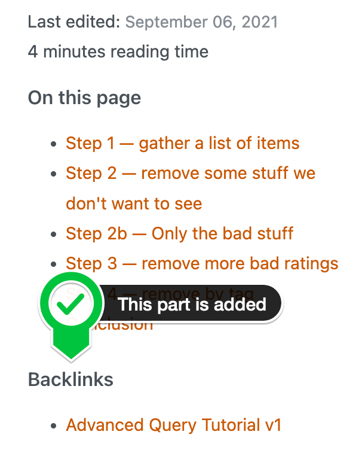

<div id="top"></div>
<!-- PROJECT SHIELDS -->

[![Contributors][contributors-shield]][contributors-url]
[![Forks][forks-shield]][forks-url]
[![Stargazers][stars-shield]][stars-url]
[![Issues][issues-shield]][issues-url]
[![MIT License][license-shield]][license-url]

<!-- PROJECT LOGO -->
<br />
<div align="center">
  <a href="https://github.com/sawhney17/logseq-schrodinger">
    
  </a>

  <h3 align="center">logseq Schrödinger</h3>

  <p align="center">
    An awesome <a href="https://logseq.com">Logseq</a> plugin to jumpstart your digital garden 🌱!
    <br />
    <a href="https://github.com/sawhney17/logseq-schrodinger"><strong>Explore the docs »</strong></a>
    <br />
    <br />
    <a href="https://aryansawhney.com/">View Demo</a>
    ·
    <a href="https://github.com/sawhney17/logseq-schrodinger/issues">Report Bug</a>
    ·
    <a href="https://github.com/sawhney17/logseq-schrodinger/issues">Request Feature</a>
  </p>
</div>

<!-- TABLE OF CONTENTS -->
<details>
  <summary>Table of Contents</summary>
  <ol>
    <li><a href="#about-the-project">About The Project</a></li>
    <li><a href="#installation">Installation</a></li>
    <li><a href="#configuration">Configuration</a>
      <ul>
        <li><a href="#meta-data">Meta-data</a></li>
        <li><a href="#configuring_hugo">Configuring Hugo</a></li>
        <li><a href="#admonitions">Admonitions</a></li>
      </ul>
    </li>
    <li><a href="#issues">Issues</a></li>
    <li><a href="#contributing">Contributing</a></li>
    <li><a href="#license">License</a></li>
    <li><a href="#contact">Contact</a></li>
    <li><a href="#acknowledgments">Acknowledgments</a></li>
  </ol>
</details>

<!-- ABOUT THE PROJECT -->

## About The Project

[![Product Name Screen Shot][product-screenshot]](https://github.com/sawhney17/logseq-schrodinger/)

[Logseq](https://logseq.com) is a great PKM (personal knowledge management) tool, but keeping your knowledge for yourself only gets you so far. As [Erwin Schrödinger](https://simple.wikipedia.org/wiki/Erwin_Schrödinger) stated:

> If a note is not published, does it really exist? — Erwin Schrödinger

Knowledge is meant to be treasured and expanded, but before all shared. This plugin helps to make that possible, or at least easier.

**Note:** This project is very much a work-in-progress. Please report <a href="#issues">issues</a> and questions.

<p align="right">(<a href="#top">back to top</a>)</p>

<!-- GETTING STARTED -->

## Installation

### Preparation

- Click the 3 dots in the righthand corner and go to **Settings**.
- Go to **Advanced** and enable **Plug-in system**.
- Restart the application.
- Click 3 dots and go to Plugins (or `Esc t p`).

### Install plugin from the Marketplace (recommended)

- Click the `Marketplace` button and then click `Plugins`.
- Find the plugin and click `Install`.

### Install plugin manually

- Download a released version assets from Github.
- Unzip it.
- Click Load unpacked plugin, and select destination directory to the unzipped folder.

<p align="right">(<a href="#top">back to top</a>)</p>

<!-- Configuration -->

## Configuration

- Click the 3 dots in the righthand corner and go to **Settings**.
- Go to **Plugin Settings**.
- Select correct plugin.

[![Configuration screen][configuration-screenshot]](##configuration)

<p align="right">(<a href="#top">back to top</a>)</p>

### Meta-data

This plugin uses YAML for the Hugo [front-matter](https://gohugo.io/content-management/front-matter/). It will convert Logseq page-properties to Hugo front matter.

Logseq _keywords_ are lowercase converted to Hugo keywords, and **category** in Logseq is translated to _categories_ for use with Hugo. Logseq _links_ (`[[like_this]]`) are stripped of `[[` and `]]`.

All other _keywords_ are just converted to Hugo _keywords_.

For now you _must_ add **date** with the posts date in the form of "2012-04-06" to your Logseq page-properties.

```markdown
date:: 2012-04-06
```

<h3 id="configuring_hugo">Configuring Hugo</h3>

[Hugo][hugo] does not by default support backlinks. Use a snippet like the following to simulate backlinks. It will parse every page for local links. This snippet should be placed in `~yourhugo/layouts/partials/backlinks.html`.

```html
{{ $re := $.File.BaseFileName }} {{ $backlinks := slice }} {{ range where
.Site.RegularPages "Type" "page" }} {{ if and (findRE $re .RawContent) (not (eq
$re .File.BaseFileName)) }} {{ $backlinks = $backlinks | append . }} {{ end }}
{{ end }} {{ if gt (len $backlinks) 0 }}
<aside>
  <h3>Backlinks</h3>
  <div class="backlinks">
    <ul>
      {{ range $backlinks }}
      <li class="capitalize"><a href="{{ .RelPermalink }}">{{ .Title }}</a></li>
      {{ end }}
    </ul>
  </div>
</aside>
{{ else }}
<aside>
  <h4>No notes link to this note</h4>
</aside>
{{ end }}

<aside class="related">
  {{ $related := .Site.RegularPages.Related . | complement $backlinks | first 3
  -}} {{ with $related -}}
  <h3>slightly related</h3>
  <ul>
    {{ range . -}}
    <li class="capitalize"><a href="{{ .RelPermalink }}">{{ .Title }}</a></li>
    {{ end -}}
  </ul>
  {{ end -}}
</aside>
```



### Admonitions

Logseq has several built-in adminitions, namely:

- caution
- example
- important
- note
- pinned
- tip
- quote
- warning

These get converted to:

```markdown
Caution here
This is an example
This is important
This is a note
This is pinned
This is a tip
This is a quote
This is a warning
```

So Hugo needs those in `~yourhugo/layouts/shortcodes/logseq/`:

```txt
orgCAUTION.html
orgEXAMPLE.html
orgIMPORTANT.html
orgNOTE.html
orgPINNED.html
orgQUOTE.html
orgTIP.html
orgWARNING.html
```

And they should contain something along the lines of:

```html
<div class="caution {{ .Get 0 }}">{{ .Inner | $.Page.RenderString }}</div>
```

<p align="right">(<a href="#top">back to top</a>)</p>

## Website templates

There are some basic website templates you can take it as a reference.

1. [logseq-hugo-template](https://github.com/sawhney17/logseq-hugo-template/), by [sawhney17](https://github.com/sawhney17).
   1. You can host your personal website with your favorite web hosting providers.
2. [Logseq-Hugo-Template](https://github.com/CharlesChiuGit/Logseq-Hugo-Template), by [CharlesChiuGit](https://github.com/CharlesChiuGit).
   1. Host your personal website with free [GitHub pages](https://pages.github.com/).

<p align="right">(<a href="#top">back to top</a>)</p>

<!-- Issues -->

## Issues

See the [open issues](https://github.com/sawhney17/logseq-schrodinger/issues) for a full list of proposed features (and known issues).

### What works

- Local Hugo links (but Logseq uses one folder for everything, so Hugo does too)
- Block refs(!) — On conversion the block is pulled from the other location
- Images
- Basic Markdown styling (including highlighting!)

### What is known to _not_ work

- Indentation Logseq ➡ Hugo is still a work-in-progress

<p align="right">(<a href="#top">back to top</a>)</p>

<!-- CONTRIBUTING -->

## Contributing

Contributions are what make the open source community such an amazing place to learn, inspire, and create. Any contributions you make are **greatly appreciated**.

If you have a suggestion that would make this better, please fork the repo and create a pull request. You can also simply open an issue with the tag "enhancement".
Don't forget to give the project a star! Thanks again!

1. Fork the Project
2. Create your Feature Branch (`git checkout -b feature/AmazingFeature`)
3. Commit your Changes (`git commit -m 'Add some AmazingFeature'`)
4. Push to the Branch (`git push origin feature/AmazingFeature`)
5. Open a Pull Request

<p align="right">(<a href="#top">back to top</a>)</p>

<!-- LICENSE -->

## License

Distributed under the MIT License. See `LICENSE.txt` for more information.

<p align="right">(<a href="#top">back to top</a>)</p>

<!-- CONTACT -->

## Contact

Aryan Sawhney - [@Aryan Sawhney](https://twitter.com/aryansawhney17)

Project Link: [https://github.com/sawhney17/logseq-schrodinger](https://github.com/sawhney17/logseq-schrodinger)

<p align="right">(<a href="#top">back to top</a>)</p>

## Acknowledgments

I would like to thank Alex Qwxlea ([@twitter_handle](https://twitter.com/QwxleaA)) for the idea to write this Logseq plugin. Also for breaking the plugin after I wrote it. And finally, thank him for adding this note: Qwxlea, you're the best 😁!

<!-- MARKDOWN LINKS & IMAGES -->
<!-- https://www.markdownguide.org/basic-syntax/#reference-style-links -->

[contributors-shield]: https://img.shields.io/github/contributors/sawhney17/logseq-schrodinger.svg?style=for-the-badge
[contributors-url]: https://github.com/sawhney17/logseq-schrodinger/graphs/contributors
[forks-shield]: https://img.shields.io/github/forks/sawhney17/logseq-schrodinger.svg?style=for-the-badge
[forks-url]: https://github.com/sawhney17/logseq-schrodinger/network/members
[stars-shield]: https://img.shields.io/github/stars/sawhney17/logseq-schrodinger.svg?style=for-the-badge
[stars-url]: https://github.com/sawhney17/logseq-schrodinger/stargazers
[issues-shield]: https://img.shields.io/github/issues/sawhney17/logseq-schrodinger.svg?style=for-the-badge
[issues-url]: https://github.com/sawhney17/logseq-schrodinger/issues
[license-shield]: https://img.shields.io/github/license/sawhney17/logseq-schrodinger.svg?style=for-the-badge
[license-url]: https://github.com/sawhney17/logseq-schrodinger/blob/master/LICENSE.txt
[product-screenshot]: images/screenshot.jpg
[configuration-screenshot]: ./images/configuration.png
[hugo]: https://gohugo.io
[logseq]: https://logseq.com
